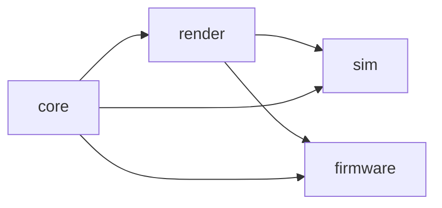

# Overhead — Handoff

_Last updated: 2026-10-03. Status: exploration done, hardware ordered, toolchain proven. Next session: design and plan._

## TL;DR

Overhead is a handheld satellite tracker: an ESP32-S3 driving a 2.7" Sharp memory LCD, with a custom real-time interface modelled on Nathan Matsuda's viz1090 flight tracker. The view is a radar-style map centred on the user's location with continuous zoom from a local radius out past the geostationary belt. Orbits are computed on-device with SGP4 from periodically downloaded CelesTrak data. It is written in Rust, with all logic and drawing developed in a desktop simulator first. Hardware is purchased and the simulator runs. Nothing is designed in detail yet. The next session should produce the design and plan before more code is written.

## Origin

- **Predecessor:** "Satellite notifier", an ESP32 project that pulled positions from a web API and output to an LED matrix. It will be rewritten rather than ported, because the display changes what the device is. The old framework/language isn't recorded.
- **Inspiration:** Nathan Matsuda's (@nathanmatsuda) DIY devices. His pattern is off-the-shelf boards, a designed 3D-printed enclosure, and a custom interface he writes himself. His viz1090 (github.com/nmatsuda/viz1090) is the closest reference: a C/SDL renderer drawing ADS-B aircraft over map geometry at the display's native resolution.
- **What appeals:** the interface changes quickly, updates in real time, and has fluid motion graphics. The device should feel like an instrument, not a dashboard.

## Decisions

Status key: **Decided** = committed. **Leaning** = agreed in discussion but not tested. **Open** = unresolved.

| Area | Decision | Status |
|---|---|---|
| Name | Overhead | Decided |
| MCU | ESP32-S3 (DevKitC-1-N8R8: 8 MB flash, 8 MB PSRAM) | Decided (purchased) |
| Display | Adafruit 4694: Sharp memory LCD, 2.7", 400×240, 1-bit, reflective | Decided (purchased) |
| Language | Rust | Leaning (simulator set up in it) |
| Editor | VS Code + rust-analyzer (probe-rs for on-device debugging later) | Decided |
| Orbit data | Compute locally with SGP4. Fetch CelesTrak elements in OMM format a few times a day. No position API. | Leaning |
| Primary view | Map centred on user location, viz1090-style, one orthographic globe projection for all zoom levels | Leaning |
| Zoom | Continuous, log-scaled, from a small local radius to beyond the GEO ring | Leaning |
| Layout | 240 px circular radar view on the left, 160 px readout panel on the right | Leaning |
| Fast satellites | Minimum on-screen traversal time. Faster objects are visually slowed. | Leaning |
| Display alternatives | E-ink rejected (too slow for real-time motion). Round colour IPS set aside (loses the 1-bit reflective look). | Decided |
| Knob, enclosure, battery, location source | Deferred until the screens look right | Open |

### Why the Sharp memory LCD

It is the only option that gives both the reflective, low-power look and real animation. The datasheet rate is about 20 Hz. People report 50 Hz in practice (the Playdate uses this panel family), but the long-term effect on the panel is unknown, so design for 20 Hz. E-ink partial refresh is about 0.3 s at best, with ghosting.

### Why local orbit computation instead of an API

Animation needs positions many times per second, and the slow-down feature needs to predict pass entry and exit before they happen. APIs are rate-limited and can't do either. Orbital elements stay usable for days, so the device also works offline. Use OMM rather than TLE, since catalog numbers are outgrowing the TLE format.

### Slow-down behaviour for fast satellites

At tight zoom, low-orbit satellites (about 5 mi/s) would cross the view in seconds. The display caps their on-screen speed. Agreed refinements:

- Centre the stretched traversal on the true time of closest approach: the marker enters early and leaves late, and is exact at the moment that matters.
- Readouts (elevation, range, overhead time) always come from the true position. The slowed marker is visual only.
- Slowed satellites get a distinguishing mark so they aren't mistaken for genuinely slow objects.
- In practice this only triggers at tight zoom.

## Constraints and known risks

- **SGP4 speed on the ESP32-S3 is the main unknown.** The S3 has single-precision floating-point hardware only, and SGP4 normally runs in double precision, which is emulated in software. This sets how many satellites can be tracked and how often. Benchmark on the old ESP32 (similar clock, same limitation) before designing around a number.
- **Catalogue scale.** Well over 10,000 active satellites, most of them Starlink. Proposed approach:
  - Filter to a curated set.
  - Sweep all positions on the second core every few seconds.
  - Extrapolate per frame using the velocity SGP4 returns.
  - Run full per-frame computation only for satellites near the view.
- **Display density.** 10,000 dots in a 240 px circle is noise. Wide zoom needs filtering or aggregate rendering regardless of compute limits.
- **Tight zoom is usually empty.** Few satellites are over any small area at once. Local views need other content: range rings, bearing ticks, approaching ground tracks, a countdown to the next pass.
- **Inland map content.** Coastlines (Natural Earth) show nothing at local zoom inland. Range rings and grids carry that view, with OSM features as a later option.
- **Panel fragility and supply.** The display is the scarce part (Mouser restock January 2027). Handle the ribbon cable carefully.

## Hardware

| Part | Source | Notes |
|---|---|---|
| ESP32-S3-DevKitC-1-N8R8 | Mouser 356-EP32S3DVKTC1N8R8 | Headers pre-soldered. Two of each part were recommended; confirm quantity ordered. |
| Adafruit 4694 Sharp 2.7" breakout | Mouser 485-4694 | Header likely needs soldering. Breakout handles 5V boost and level shifting. Wiring: power, ground, clock, data, chip select. |
| Old ESP32 (from Satellite notifier) | Already owned | Use for the SGP4 benchmark. |

Also needed: breadboard, jumper wires, a USB data cable, a soldering iron.

## Toolchain and repo state

Repo at `~/Code/Overhead`. Cargo workspace:

```
overhead/
  Cargo.toml            # workspace: resolver, members, exclude = ["firmware"]
  .cargo/config.toml    # macOS linker path for Homebrew SDL2 (see below)
  core/    → overhead-core     # no_std: orbits, projection, state
  render/  → overhead-render   # no_std: draws into any DrawTarget<BinaryColor>
  sim/     → overhead-sim      # macOS: simulator window, input, frame loop
  tools/   → overhead-tools    # offline data conversion (coastlines)
  firmware/                    # later; excluded; needs Espressif toolchain
  data/                        # CelesTrak OMM snapshot, preprocessed coastlines
```



`core` and `render` never touch hardware. Everything built in the simulator moves to the device unchanged, because the simulator display and the Sharp driver both implement embedded-graphics' `DrawTarget`.

**Done and verified:**
- Rust toolchain installed and updated. SDL2 installed via Homebrew.
- Workspace created with four crates.
- `overhead-sim` opens a 400×240 1-bit window at 2× scale (LcdWhite theme) and draws a circle and a label.

**Written but not confirmed run:**
- A frame loop. `core` holds a `State` (log-scale zoom with frame-rate-independent easing, a rotating sweep angle). `render` has a `draw(state, target)` function. `sim` runs a ~30 fps loop with up/down keys for zoom.

**Not started:**
- Stage 2 toolchain: `espup`, `espflash`, `esp-generate`.
- SGP4 benchmark.
- Map data pipeline.
- Firmware crate.

### Gotchas already hit

- **A crate can't be named `core`.** It clashes with Rust's built-in `core` library. Packages are prefixed `overhead-*`; folders stay short.
- **The SDL2 linker can't find the library** (`ld: library 'SDL2' not found`). Homebrew on Apple Silicon installs to `/opt/homebrew/lib`, which isn't on the default linker path. Fix: in `.cargo/config.toml`, under `[target.aarch64-apple-darwin]`, set `rustflags = ["-L", "/opt/homebrew/lib"]`. The alternative is `LIBRARY_PATH` in `~/.zshrc`. Confirm which is in place.
- **`no_std` maths and strings.**
  - `sin`, `exp` and similar need `libm` in `no_std` crates.
  - Text formatting without a heap uses `heapless::String<N>` with `core::fmt::Write`.
- **Workspace resolver.** Use `"3"` if the crates are edition 2024, `"2"` for edition 2021.

## Open questions for the design session

1. **Screens and modes.** Is there one continuous zoomable view, or distinct modes (radar, sky plot, pass list, globe)? How does the user move between them?
2. **What a tight local zoom shows** when no satellite is present.
3. **Catalogue scope.** Which satellites by default? Is Starlink a toggleable layer, and how is it drawn at wide zoom?
4. **Projection details.**
   - Top-down orthographic for everything, or a horizon sky plot as a separate view?
   - How are satellites behind Earth handled?
5. **Slow-down parameters.** The minimum traversal time, and the visual mark for slowed objects.
6. **Time control.**
   - Does time scrubbing (60×, 600×) exist on the device, or only in the simulator?
   - How does it interact with the slow-down?
7. **Visual language.**
   - Pixel fonts, grid, dither patterns, how inversion is used.
   - Motion rules: what eases, what snaps, transition styles.
8. **Location source.** Hardcoded, set via Wi-Fi or a phone, or GPS later.
9. **SGP4 performance budget.** Pending the benchmark.
10. **Input model.** Knob plus buttons? Not now, but the design should leave room for it.

## Proposed document structure

To be settled next session. A starting point:

```
docs/
  design.md      # what Overhead is, the views, interaction, visual language, key decisions
  plan.md        # milestones in order, each with a definition of done
  progress.md    # dated log of what was done and learned
  handoff.md     # current state for picking up cold (this file, kept short and current)
  decisions/     # optional: one short record per significant decision
```

`design.md` follows a design-doc spine: TL;DR, context, goals and non-goals, proposal, key decisions with rationale, alternatives considered, open questions. `handoff.md` is rewritten at the end of each session rather than appended to. `progress.md` holds the history.

## Suggested next steps

1. **Design session.** Resolve the open questions above and write `design.md`.
2. **Plan.** Break the design into milestones in `plan.md`. Likely order:
   - SGP4 benchmark
   - Simulator frame loop and input
   - Projection and zoom
   - Map data
   - Satellites from real data
   - Slow-down
   - Visual polish
   - Firmware bring-up
   - Enclosure and input hardware
3. **When the boards arrive.** Solder the display header, wire it to the S3, and get a test pattern on the real panel.
